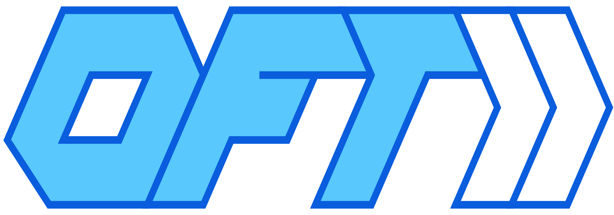
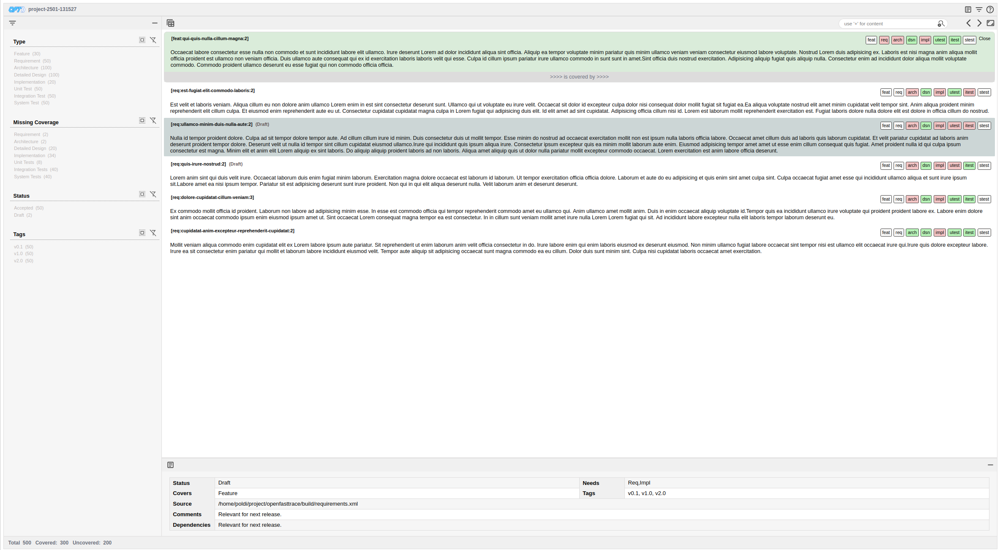

#  OpenFastTrace UX

## What is OpenFastTrace UX?

OpenFastTrace UX (short OFT-UX) extends the [OpenFastTrace](https://github.com/itsallcode/openfasttrace)
requirement tracing tool by an interactive requirement analysis frontend. It provides a web-based user interface 
that allows to explore linkage between requirements and other traceable artifacts, query statistics and identify
missing linkages and untested/unimplemented parts of your software.

## Status

This version of OpenFastTrace UX is fully functional version of the OpenFastTrace frontend just missing some already 
planned features.  It provides advanced filtering and navigation capabilities to quickly browse through requirements 
and other traceable artifacts in order to find gaps in the tracing change or just to find necessary documents 
identifiable by te tracing chain.

It works in conjunction with an extended version of [OpenFastTrace](https://github.com/itsallcode/openfasttrace/pull/446) and
[OpenFastTrace Gradle Plugin](https://github.com/itsallcode/openfasttrace-gradle/pull/49) which are needed for 
generating the necessary input data for OFT UX.

## Project Information

[](https://github.com/poldi2015/openfasttrace-ux/actions/workflows/webpack.yml)

This project is a pure HTML application developed with HTML, SCSS and Typescript.

# 

## Playground

Openfasttrace UX provides a playground to try out the user interface with sample data:

[OpenFastTrace UX playground](https://poldi2015.github.io/openfasttrace-ux/)

## Features

### Tracing tool

* &cross; **OFT reporter plugin**: Extension of the list of supported reporters for OFT.

### User Interface

* &check; **Titlebar**: Titlebar on top with project details.
* &check; **Statusbar**: Statusbar at the bottom with key statistics.
* &check; **Filter sidebar**: Sidebar to the left allows to filter all items by key attributes.
* &check; **Item browser**: The central part of thr UI list all requirements and other artifacts like test cases.
  * &check; **Item state**: Badges indicate the linkagle state of each item.
  * &check; **Focus item**: An item can be pinned to show all its linked items.
* &check; **Navigation history**: The UI records all navigation steps allowing to jump back and forward in history.
* &check; **Search**: A interactive search allows to filter items by name or content via substrings or regular expresssions.
* &check; **Tree sidebar**: A tree groups items by type and name allowing to quickly navigate in parts of the project.
* &check; **Details sidebar**: A details sidebar at the bottom provides a link to the source of an item and lists all false links.
* &check; **Keybaord navigation**: The main browser and the search can be fully controlled via keyboard.
* &check; **Copy to clibboard**: Copy buttons allow to quickly copy central inormation to the clipboard.
* ...

## Build OFT UX

The software is built via [Webpack](https://webpack.js.org/) which builds a HTML page including CSS and Javascript.
To build the application you need to have [npm](https://github.com/nvm-sh/nvm) installed on your system.

```bash
$ npm install
$ npm run build
$ npm run test
```

## Contact

* [Bernd (Poldi) Haberstumpf <poldi@thatswing.de>](mailto:poldi@thatswing.de)
